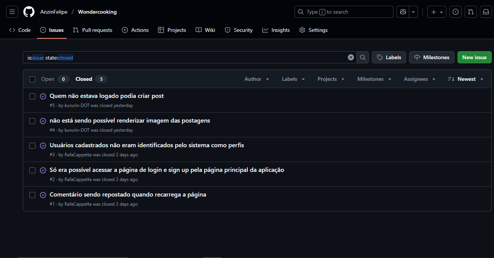

# 🍰 Projeto Wondercooking

Wondercooking é uma aplicação web feita para pesquisa, visualização e compartilhamento de receitas de culinária para o mundo.

## 👩‍🎓 Integrantes do Projeto

- Ian Felipe Costa van Drunen
- Igor Arruda Coelho
- Rafael Chiappetta Barboza
- Sofia Pan Yu
- Telmo Melo Ferreira Calheiros
- Thiago Neiva de Lima Santos

## 💾 Entregas:

Entrega 01:

## 📝 Jira:

Utilizamos o Jira para criar nosso backlog e nossa primeira sprint com 7 histórias de usuário.

Backlog:
\

Quadro sprint:
\

Acesse nosso Jira clicando aqui:
<a href = "https://cesar-team-pz3i66at.atlassian.net/jira/software/projects/WON/boards/34" target = "_blanck"> ir para o Jira</a>

Acesse o nosso documento das histórias de usuário com cenários de validação utilizando BDD:
<a href = "https://docs.google.com/document/d/1IX6r9FOJcd_eR8FyVsrMSKdi9eVuUcwD_jcz5_sBhKQ/edit?tab=t.0" target = "_blanck">ir para o Docs</a>

## 🎨 Figma:

Utilizamos o Figma para crair nosso protótipo de baixa fidelidade e adicionamos o screencast para apresentá-lo.

Visualize nosso protótipo Lo-fi pelo screencast clicando aqui: 
<a href = "https://youtu.be/JA0FdsLmdgc" target = "_blanck">ir para o screencast</a>

Visualize nosso protótipo Lo-fi pelo Figma clicando aqui:
<a href = "https://www.figma.com/design/gEc7YbPocqWbVVGBQgXbeb/Untitled?node-id=1-703&t=F3tTupZ39Z28jbL0-0">ir para o Figma</a>

Entrega 02:

  
## Programação em Par

Segue abaixo links para acessar a documentação da programação em par:

Dupla 001: [Link de acesso.](https://docs.google.com/document/d/1VMShdnzmD7LD9jPJXrcCvs5p0LIE16-E2SSJfQTupZ0/edit?usp=sharing)

Dupla 002: [Link de acesso.](https://docs.google.com/document/d/1eHmU18Bjz6BKVYZzzzeMdUzSkjeLxBpYUKqnVwqAahE/edit?usp=sharing)

Dupla 003: [Link de acesso.](https://docs.google.com/document/d/1_7FUateEpQVbhTdNlaI2qU6icwHFJ50icyU12_h-VXE/edit?usp=sharing)

## Bug Tracker

Bug tracker dos problemas que ocorreram no prolongar do projeto

---
