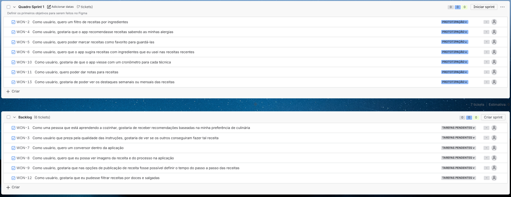
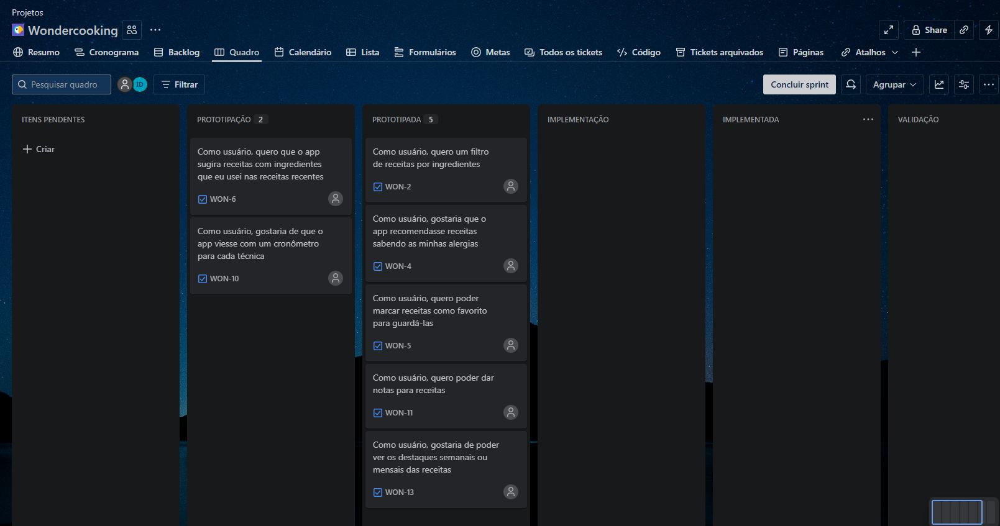
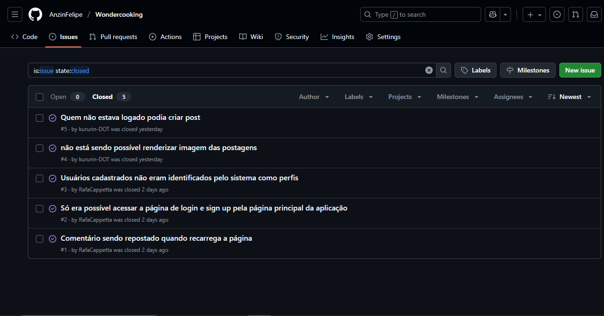
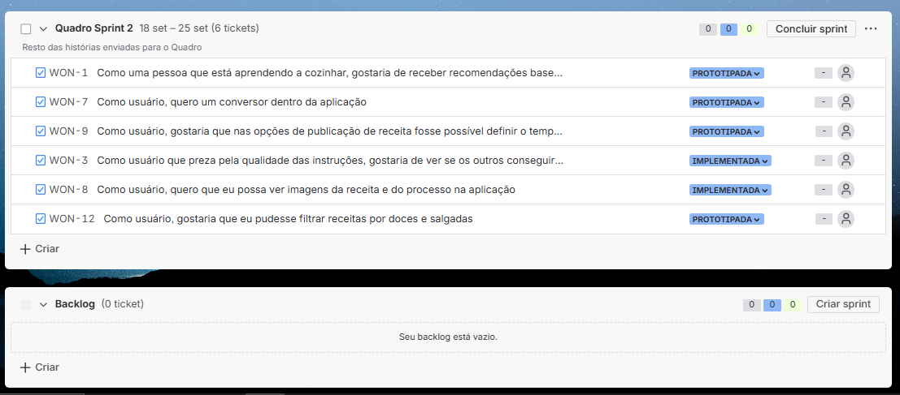
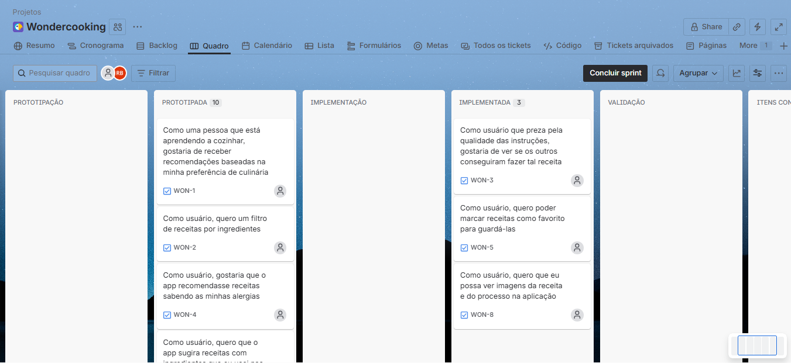
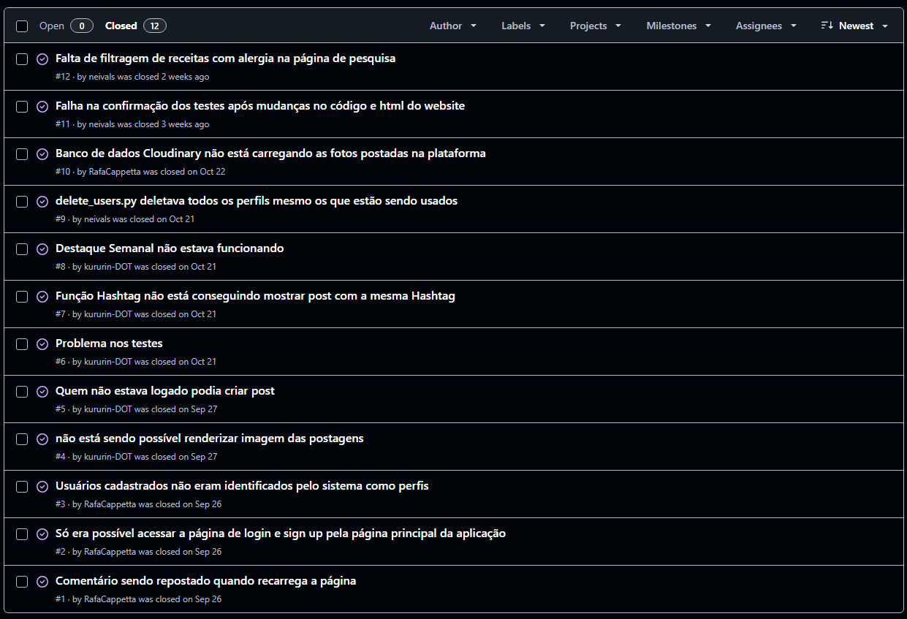
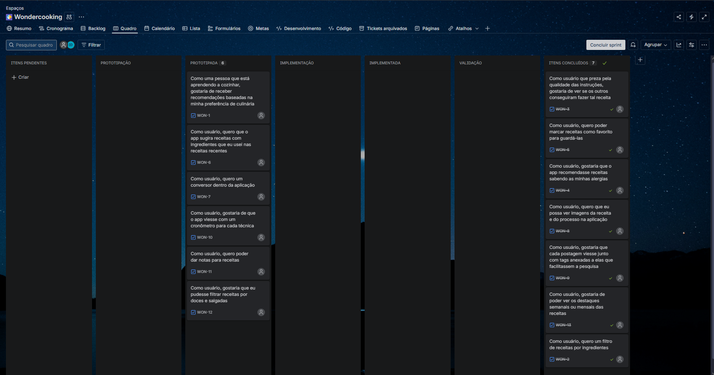

# 🍰 Projeto Wondercooking

Você, meu caro leitor, ainda sofre por não conseguir achar receitas do seu gosto o(´^｀)o? Ou ainda sofre para encontrar tutoriais de técnicas específicas do universo culinário ಥ_ಥ? 

Seus dias de sofrimento acabaram! Pois agora neste exato segundo e momento, eu lhe apresento...

### ⁽(◍˃̵͈̑ᴗ˂̵͈̑)⁽ Wondercooking!

|•'-'•) ✧ Wondercooking é a plataforma definitiva para amantes da culinária! Conecte-se com cozinheiros amadores do mundo todo, compartilhe suas melhores receitas e descubra um universo de novos sabores e técnicas. Sua cozinha nunca mais será a mesma!

No Wondercooking, voce poderá experienciar:

1. Interação com usuários de diferentes origens! ₍ᐢ •͈ ༝ •͈ ᐢ₎♡

2. Uma viagem gastronomica de escala internacional dentro do seu bolso e no seu cantinho de conforto! (•̀ᴗ• )

3. Tem alguma restrição alimentar ou alergia? Menor problema! Filtros lhe darão suporte para descobrir receitas na qual estão loooooooonges das suas restrições! (｡•ᴗ-)_

## 👩‍🎓 Integrantes do Projeto

- Ian Felipe Costa van Drunen
- Igor Arruda Coelho
- Rafael Chiappetta Barboza
- Sofia Pan Yu
- Telmo Melo Ferreira Calheiros
- Thiago Neiva de Lima Santos

## 💾 Entregas:

Entrega 01:

## 📝 Jira:

Utilizamos o Jira para criar nosso backlog e nossa primeira sprint com 7 histórias de usuário.

Backlog:
\

Quadro sprint:
\

Acesse nosso Jira clicando aqui:
<a href = "https://cesar-team-pz3i66at.atlassian.net/jira/software/projects/WON/boards/34" target = "_blanck"> ir para o Jira</a>

Acesse o nosso documento das histórias de usuário com cenários de validação utilizando BDD:
<a href = "https://docs.google.com/document/d/1IX6r9FOJcd_eR8FyVsrMSKdi9eVuUcwD_jcz5_sBhKQ/edit?tab=t.0" target = "_blanck">ir para o Docs</a>

## 🎨 Figma:

Utilizamos o Figma para crair nosso protótipo de baixa fidelidade e adicionamos o screencast para apresentá-lo.

Visualize nosso protótipo Lo-fi pelo screencast clicando aqui: 
<a href = "https://youtu.be/JA0FdsLmdgc" target = "_blanck">ir para o screencast</a>

Visualize nosso protótipo Lo-fi pelo Figma clicando aqui:
<a href = "https://www.figma.com/design/gEc7YbPocqWbVVGBQgXbeb/Untitled?node-id=1-703&t=F3tTupZ39Z28jbL0-0">ir para o Figma</a>

Entrega 02:

  
## 💻 Programação em Par

Segue abaixo links para acessar a documentação da programação em par:

Dupla 001: [Link de acesso.](https://docs.google.com/document/d/1VMShdnzmD7LD9jPJXrcCvs5p0LIE16-E2SSJfQTupZ0/edit?usp=sharing)

Dupla 002: [Link de acesso.](https://docs.google.com/document/d/1eHmU18Bjz6BKVYZzzzeMdUzSkjeLxBpYUKqnVwqAahE/edit?usp=sharing)

Dupla 003: [Link de acesso.](https://docs.google.com/document/d/1_7FUateEpQVbhTdNlaI2qU6icwHFJ50icyU12_h-VXE/edit?usp=sharing)

## 🐞 Bug Tracker

Bug tracker dos problemas que ocorreram no prolongar do projeto

## 📝 Jira:

Atualizamos o backlog e iniciamos uma segunda sprint com 6 histórias de usuário e passando 3 histórias para a etapa de implementação. 

Backlog da sprint 2:
\

Quadro sprint 2:
\

HISTÓRIAS IMPLEMENTADAS:

HISTÓRIA 3: Como usuário que preza pela qualidade das instruções, gostaria de ver se os outros conseguiram fazer tal receita. 
HISTÓRIA 5: Como usuário, quero poder marcar receitas como favorito para guardá-las. 
HISTÓRIA 8: Como usuário, quero que eu possa ver imagens da receita e do processo na aplicação. 

Acesse nosso Jira clicando aqui:
<a href = "https://cesar-team-pz3i66at.atlassian.net/jira/software/projects/WON/boards/34" target = "_blanck"> ir para o Jira</a>

## 📸 Screencast da plataforma em funcionamento

Acesse a gravação clicando aqui:
<a href = "https://youtu.be/_rKbCtVq0rg"> Ir para o vídeo</a>

Entrega 03:

## 💻 Programação em Par atualizada

Segue abaixo links para acessar a versão atualizada da documentação da programação em par:

Dupla 001: [Link de acesso.](https://docs.google.com/document/d/1VMShdnzmD7LD9jPJXrcCvs5p0LIE16-E2SSJfQTupZ0/edit?usp=sharing)

Dupla 002: [Link de acesso.](https://docs.google.com/document/d/1eHmU18Bjz6BKVYZzzzeMdUzSkjeLxBpYUKqnVwqAahE/edit?usp=sharing)

Dupla 003: [Link de acesso.](https://docs.google.com/document/d/1_7FUateEpQVbhTdNlaI2qU6icwHFJ50icyU12_h-VXE/edit?usp=sharing)

## 🐞 Bug Tracker

Bug tracker dos problemas que ocorreram no prolongar do projeto

## 📝 Jira:

Atualizamos o backlog e iniciamos uma terceira sprint com 6 histórias de usuário e passando 3 histórias para a etapa de implementação. 

Quadro sprint 3:
\

HISTÓRIAS IMPLEMENTADAS:

HISTÓRIA 9: Como usuário, gostaria que cada postagem viesse junto com tags anexadas a elas que facilitassem a pesquisa 
HISTÓRIA 13: Como usuário, gostaria de poder ver os destaques semanais ou mensais das receitas

Acesse nosso Jira clicando aqui:
<a href = "https://cesar-team-pz3i66at.atlassian.net/jira/software/projects/WON/boards/34" target = "_blanck"> ir para o Jira</a>

## 📸 Screencasts do site

Acesse as gravações clicando aqui: 
<a href = "https://youtu.be/Qjeoq8JZPMM"> Cypress</a>
<a href = "https://youtu.be/AlMmL2M8T5w"> CD/CI // Processo do Deploy</a> 
<a href = "https://youtu.be/iu6VzqGaWm0"> Deploy do site</a>

Entrega 04:

## 💻 Programação em Par atualizada

Segue abaixo links para acessar a versão final da documentação da programação em par:

Dupla 001: [Link de acesso.](https://docs.google.com/document/d/1VMShdnzmD7LD9jPJXrcCvs5p0LIE16-E2SSJfQTupZ0/edit?usp=sharing)

Dupla 002: [Link de acesso.](https://docs.google.com/document/d/1eHmU18Bjz6BKVYZzzzeMdUzSkjeLxBpYUKqnVwqAahE/edit?usp=sharing)

Dupla 003: [Link de acesso.](https://docs.google.com/document/d/1_7FUateEpQVbhTdNlaI2qU6icwHFJ50icyU12_h-VXE/edit?usp=sharing)

## 🐞 Bug Tracker

Bug tracker dos problemas que ocorreram no prolongar do projeto

## 📝 Jira:

Atualizamos o backlog e iniciamos uma quarta sprint com as 7 histórias de usuário nos intens concluídos.

Quadro sprint 4:

HISTÓRIAS IMPLEMENTADAS:

HISTÓRIA 2: Como usuário, quero um filtro de receitas por ingredientes.

Acesse nosso Jira clicando aqui:
<a href = "https://cesar-team-pz3i66at.atlassian.net/jira/software/projects/WON/boards/34" target = "_blanck"> ir para o Jira</a>

## 📸 Screencasts do site

Acesse as gravações clicando aqui: 
<a href = "https://youtu.be/Qjeoq8JZPMM"> Cypress</a>
<a href = "https://youtu.be/AlMmL2M8T5w"> CD/CI // Processo do Deploy</a> 
<a href = "https://youtu.be/iu6VzqGaWm0"> Deploy do site</a>

## Contribuing

Se você ficou interessado no nosso projeto e quer contribuir de alguma forma, acesse o nosso contribuing: <a href = "https://github.com/AnzinFelipe/Wondercooking?tab=contributing-ov-file"> ir para o contribuing</a>

